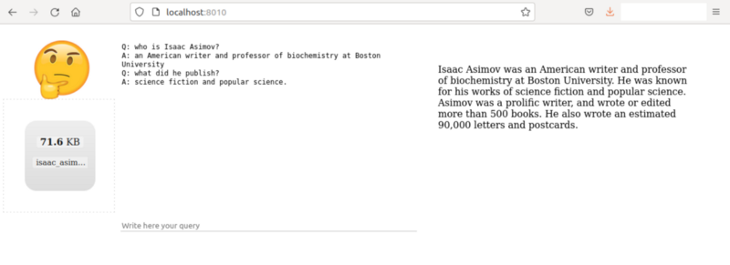

# Code related to the medium post "Building a Bot, Journal Entry #1" 



The system presented here allows the user to upload a text document on the left side, wait a few seconds, and then ask questions about the text in a conversational manner. For now, the user can only upload a plain text file (no pdf, no word documents, nor HTML). The relevant paragraph of text appears on the right column.

This code follows the well-established Retriever/Reader paradigm to answer questions in a conversational form. The model is GPT2 fine-tuned on the CoQA dataset, both available as open-source projects.

## How to run the system

One can run the webserver by using the provided Dockerfile

```bash
$ sudo docker build . -t bot1
$ docker run -p 8010:8010 bot1
```

and then access the site at http://localhost:8010. It might take a few minutes to download all the packages and models.

## How to download a list of forbidden words

The bot looks into a list of words that would trigger an empty answer.
A convenient list can be downloaded as follows. 

```bash
$ cd data
$ wget https://www.cs.cmu.edu/~biglou/resources/bad-words.txt
```
This repo has a placeholder empty list and can work without replacing it. 

